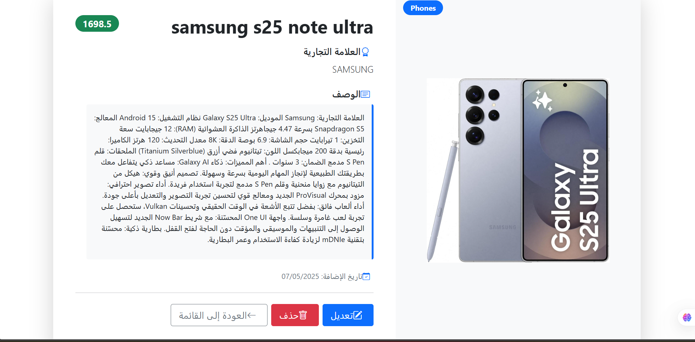
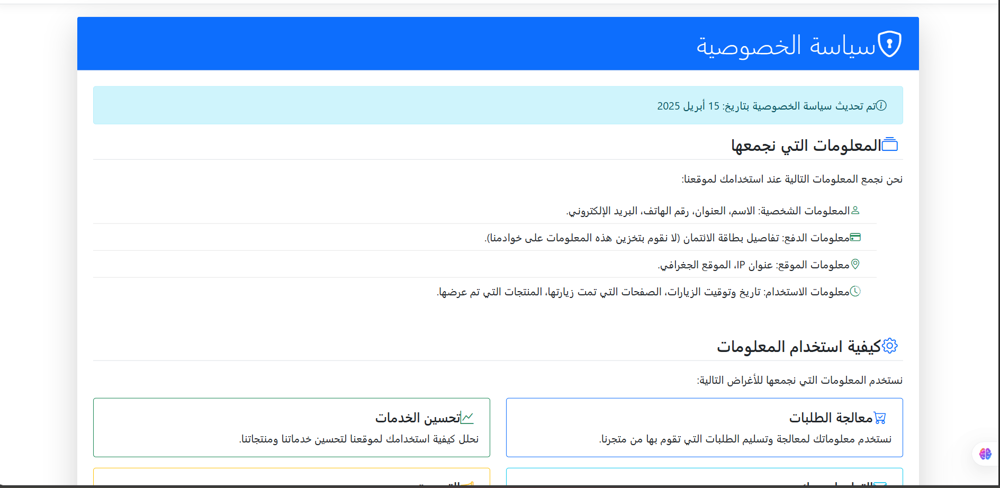

# الـ Store_app (تطبيق المتجر)

تطبيق ويب مبني باستخدام الـ ASP.NET Core MVC يهدف إلى إدارة وعرض قائمة بالمنتجات لمتجر إلكتروني. يوفر التطبيق واجهة لإضافة منتجات جديدة، تعديل المنتجات الحالية، عرض تفاصيلها، وحذفها. كما يعرض المنتجات بشكل جذاب في الصفحة الرئيسية مع تصنيفها.

## الميزات الرئيسية

*   **إدارة كاملة للمنتجات:**
    *   عرض قائمة بجميع المنتجات مع صورها وتفاصيلها الأساسية.
    *   إنشاء منتجات جديدة مع تحميل صورة للمنتج.
    *   تعديل بيانات المنتجات الحالية، مع إمكانية تحديث الصورة.
    *   عرض صفحة تفاصيل لكل منتج.
    *   حذف المنتجات من النظام (مع حذف ملف الصورة المرتبط بها).
*   **الصفحة الرئيسية:**
    *   عرض أحدث 4 منتجات تمت إضافتها كـ "منتجات مميزة".
    *   عرض المنتجات مصنفة حسب الفئات (يتم عرض أول 3 فئات وكل فئة تعرض حتى 4 منتجات).
*   **واجهة مستخدم:** تصميم بسيط وسهل الاستخدام يعتمد على الـ Bootstrap (أو ما شابه).
*   **تخزين البيانات:** استخدام الـ Entity Framework Core للتفاعل مع قاعدة بيانات الـ SQL Server.

## صور من صفحات المشروع

1.  **الصفحة الرئيسية (`/`)**
    

2.  **صفحة إضافة منتج جديد (`/Products/Create`)**
    

3.  **قائمة المنتجات (`/Products` أو `/Products/Index`)**
    

4.  **صفحة تفاصيل المنتج (`/Products/Details/{id}`)**
    

5.  **صفحة تعديل المنتج (`/Products/Edit/{id}`)**
    

6.  **صفحة سياسة الخصوصية (`/Home/Privacy`)**
    

7.  **تذييل الصفحة (الـ Footer)**
    

8.  **صفحة تأكيد حذف المنتج (`/Products/Delete/{id}`)**
    

## التقنيات المستخدمة

*   الـ ASP.NET Core MVC (.NET 6 أو أحدث على الأرجح بناءً على `Program.cs` النموذجي)
*   الـ Entity Framework Core
*   الـ C#
*   الـ SQL Server (أو الـ SQL Server Express)
*   الـ HTML, CSS, JavaScript (الـ Bootstrap ضمنيًا في عروض الـ MVC القياسية)

## المتطلبات الأساسية لتشغيل المشروع

*   الـ **.NET SDK:** (يفضل .NET 6 أو أحدث، بناءً على نمط `Program.cs`)
*   الـ **SQL Server أو الـ SQL Server Express:** يجب أن يكون لديك نسخة من الـ SQL Server مثبتة وقيد التشغيل.
*   الـ **Visual Studio 2022** (موصى به) أو أي محرر كود يدعم تطوير الـ ASP.NET Core.

## إعداد وتشغيل المشروع

1.  **استنساخ المستودع (الـ Clone):**
    إذا كنت ستقوم برفع هذا المشروع إلى الـ GitHub، فسيقوم المستخدمون الآخرون باستنساخ المستودع.
    ```bash
    git clone https://github.com/your-username/Store_app.git
    cd Store_app
    ```

2.  **فتح المشروع:**
    افتح ملف الحل `Store_app.sln` باستخدام الـ Visual Studio.

3.  **تعديل سلسلة الاتصال بقاعدة البيانات (الـ Connection String):**
    *   افتح ملف `appsettings.json` في جذر المشروع.
    *   ابحث عن القسم التالي:
        ```json
        "ConnectionStrings": {
          "DefaultConnection": "Data Source=AMJED\\SQLEXPRESS;Initial Catalog=DbProducts;Integrated Security=True;Connect Timeout=30;Encrypt=False;TrustServerCertificate=False;ApplicationIntent=ReadWrite;MultiSubnetFailover=False"
        }
        ```
    *   **هام جدًا:** قم بتغيير قيمة `Data Source` من `AMJED\\SQLEXPRESS` إلى اسم خادم الـ SQL Server المحلي الخاص بك.
        *   إذا كنت تستخدم الـ SQL Server Express المثبت محليًا بالاسم الافتراضي، فقد يكون `localhost\\SQLEXPRESS` أو `.\\SQLEXPRESS`.
        *   إذا كنت تستخدم نسخة مطور أو قياسية من الـ SQL Server، فقد يكون `localhost` أو اسم جهازك.
    *   تأكد من أن اسم قاعدة البيانات `Initial Catalog=DbProducts` مناسب لك. إذا لم تكن قاعدة البيانات موجودة، سيقوم الـ Entity Framework Core بإنشائها في الخطوة التالية.

4.  **تطبيق التهجيرات (الـ Migrations) وإنشاء قاعدة البيانات:**
    *   في الـ Visual Studio، اذهب إلى `Tools` -> `NuGet Package Manager` -> `Package Manager Console`.
    *   تأكد أن "Default project" المحدد في نافذة الـ Package Manager Console هو `Store_app`.
    *   نفذ الأمر التالي لإنشاء/تحديث قاعدة البيانات بناءً على التهجيرات الموجودة في مجلد `Migrations`:
        ```powershell
        Update-Database
        ```
    *   هذا الأمر سيقوم بإنشاء قاعدة البيانات `DbProducts` (إذا لم تكن موجودة) والجداول المطلوبة (`Products` إلخ).

5.  **تشغيل المشروع:**
    اضغط `Ctrl+F5` أو زر التشغيل الأخضر (عادةً ما يكون مكتوب عليه "Store_app") في الـ Visual Studio لبدء تشغيل التطبيق. سيتم فتحه في متصفح الويب الافتراضي لديك.

## مفاهيم عمل المشروع

يتبع المشروع نمط تصميم الـ Model-View-Controller (MVC):

*   **الـ Models (النماذج):** موجودة في مجلد `Models`.
    *   `Product.cs`: يمثل كيان المنتج بخصائص مثل الاسم، العلامة التجارية، الفئة، السعر، الوصف، اسم ملف الصورة، وتاريخ الإنشاء. هذا هو الكيان الذي يتم تخزينه في قاعدة البيانات.
    *   `ProductDto.cs`: (الـ Data Transfer Object) يُستخدم لنقل البيانات بين العرض (الـ View) ووحدة التحكم (الـ Controller)، خاصة عند إنشاء أو تعديل منتج. يحتوي على حقول مشابهة لـ `Product` بالإضافة إلى `IFormFile ImageFile` لتمكين تحميل ملف الصورة.
    *   `ErrorViewModel.cs`: نموذج قياسي لعرض معلومات الخطأ.

*   **الـ Views (العروض):** موجودة في مجلد `Views`. وهي ملفات `.cshtml` (الـ Razor) مسؤولة عن عرض واجهة المستخدم.
    *   `Views/Home/Index.cshtml`: الصفحة الرئيسية للتطبيق، تعرض المنتجات المميزة والمنتجات حسب الفئة.
    *   `Views/Products/Index.cshtml`: تعرض قائمة بجميع المنتجات مع خيارات التعديل والحذف والتفاصيل.
    *   `Views/Products/Create.cshtml`: نموذج لإضافة منتج جديد.
    *   `Views/Products/Edit.cshtml`: نموذج لتعديل منتج موجود.
    *   `Views/Products/Details.cshtml`: تعرض تفاصيل كاملة لمنتج واحد.
    *   `Views/Products/Delete.cshtml`: صفحة تأكيد حذف المنتج.
    *   `Views/Shared/`: تحتوي على العروض المشتركة مثل `_Layout.cshtml` (التخطيط الرئيسي للصفحات) و `_ValidationScriptsPartial.cshtml`.

*   **الـ Controllers (وحدات التحكم):** موجودة في مجلد `Controllers`.
    *   `HomeController.cs`:
        *   `Index()`: يقوم بجلب المنتجات المميزة (الأحدث) والمنتجات مقسمة حسب الفئات لعرضها في الصفحة الرئيسية.
        *   `Privacy()`: صفحة الخصوصية القياسية.
        *   `Error()`: يعرض صفحة الخطأ.
    *   `ProductsController.cs`:
        *   يحتوي على جميع الإجراءات (الـ Actions) المتعلقة بإدارة المنتجات (الـ CRUD - Create, Read, Update, Delete).
        *   `Index()`: يعرض قائمة بجميع المنتجات.
        *   `Create()`: (الـ GET) يعرض نموذج الإنشاء، (الـ POST) يعالج بيانات النموذج، يحفظ الصورة في `wwwroot/products`، ويحفظ المنتج في قاعدة البيانات.
        *   `Edit(id)`: (الـ GET) يعرض نموذج التعديل مع بيانات المنتج الحالي، (الـ POST) يعالج التعديلات، يحدث الصورة إذا تم تحميل صورة جديدة، ويحفظ التغييرات في قاعدة البيانات.
        *   `Details(id)`: يعرض تفاصيل المنتج المحدد.
        *   `Delete(id)`: (الـ GET) يعرض صفحة تأكيد الحذف، (الـ POST) يحذف المنتج من قاعدة البيانات ويحذف ملف الصورة المرتبط به من `wwwroot/products`.

*   **الـ Services (الخدمات - مجلد `services` داخل المشروع الرئيسي):**
    *   `ApplicationDbcontext.cs`: يمثل سياق قاعدة البيانات لـ الـ Entity Framework Core. يعرّف `DbSet<Product>` الذي يمثل جدول المنتجات ويتيح التفاعل مع قاعدة البيانات.

*   **الـ wwwroot:** مجلد يحتوي على الملفات الثابتة مثل الـ CSS، الـ JavaScript، والصور.
    *   `wwwroot/products/`: المجلد الذي يتم فيه حفظ صور المنتجات التي يتم تحميلها.

*   **الـ Migrations:** مجلد يحتوي على ملفات تهجير قاعدة البيانات التي أنشأها الـ Entity Framework Core. هذه الملفات تصف التغييرات التي يجب تطبيقها على مخطط قاعدة البيانات.
